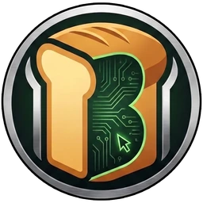

# KSBravo
**Nextbots, NPCs y herramientas a medida para Garry's Mod y s&box.**

Un pequeño estudio familiar. Modelamos, riggeamos, animamos y compilamos personajes para Source y s&box, y construimos las herramientas que usamos para hacerlo rápido.

<a class="ks-btn" href="../es/commissions/">Pedir un encargo</a>
<a class="ks-btn ghost" href="../es/work/">Ver trabajos</a>

<b>40+</b>publicaciones en el Steam Workshop

<b>22</b>packs de 3D Memes y contando

<b>100+</b>personajes entregados a clientes privados

<b>2</b>motores: Source (GMod) y s&box

## Qué hacemos

### Nextbots y NPCs para Garry's Mod
Tu personaje, desde una imagen 2D o un modelo 3D, convertido en un nextbot DrGBase funcional: rig, animaciones, sonidos, ataques, ragdoll. Listo para tirar en `addons`.

### Ports a s&box
Los mismos personajes corriendo sobre **SBHBase**, nuestra base de nextbots para s&box: posesión, facciones, jumpscares, sistemas de ritmo y más.

### Herramientas para servidores y creadores
Tools de Sandbox como la arena Force Meter, ranking y contrarreloj, y nuestras propias herramientas de producción que convierten un personaje en un nextbot funcional en un clic.

## Último showcase

<iframe src="https://www.youtube-nocookie.com/embed/J8TZjflXbgc" title="3D Memes Pack 21 - Garry's Mod Ready" allowfullscreen loading="lazy"></iframe>

Packs y showcases nuevos cada pocas semanas en [YouTube](https://www.youtube.com/@KSBravo){target=_blank}.

## Cómo pedir

<ol class="ks-steps">
<li>Mandanos el personaje: una imagen, un video de referencia o un modelo 3D, y contanos qué tiene que hacer (caminar, correr, atacar, sonidos).</li>
<li>Te respondemos con precio y fecha de entrega. La mayoría de los personajes sueltos llevan de 1 a 3 días.</li>
<li>Recibís un video del personaje funcionando en el juego antes de pagar.</li>
<li>Recibís el addon, listo para instalar.</li>
</ol>

<a class="ks-btn" href="../es/commissions/">Precios y detalles</a>
