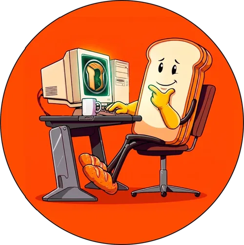

# KSBravo

Nextbots, NPCs y herramientas a medida para Garry's Mod y s&box.

Un pequeño estudio familiar. Modelamos, riggeamos, animamos y compilamos personajes para Source y s&box, y construimos las herramientas que usamos para hacerlo rápido.

<a class="ks-btn" href="../es/commissions/">Encargos</a>
<a class="ks-btn ghost" href="../es/work/">Ver trabajos</a>

<!-- KS-ACCESOS -->

## Qué hacemos

### Nextbots y NPCs para Garry's Mod
Tu personaje, desde una imagen 2D o un modelo 3D, convertido en un nextbot DrGBase funcional: rig, animaciones, sonidos, ataques, ragdoll. Listo para tirar en `addons`.

### Ports a s&box
Los mismos personajes corriendo sobre **SBHBase**, nuestra base de nextbots para s&box: posesión, facciones, jumpscares, sistemas de ritmo y más.

## Último showcase

<!-- KS-SHOWCASE -->

Packs y showcases nuevos cada pocas semanas en [YouTube](https://www.youtube.com/@KSBravo){target=_blank rel=noopener}.

## Cómo pedir

<ol class="ks-steps">
<li>Mandanos el personaje por el <a href="../es/commissions/">formulario</a> o por un ticket privado en <a href="https://discord.gg/bMudjAq2JR" target="_blank" rel="noopener">Discord</a>: una imagen, un video de referencia o un modelo 3D, y contanos qué tiene que hacer (caminar, correr, atacar, sonidos).</li>
<li>Te respondemos con precio y fecha de entrega para ese pedido. Nada arranca hasta que estés de acuerdo.</li>
<li>Recibís un video del personaje funcionando en el juego antes de pagar.</li>
<li>Recibís el addon, listo para instalar.</li>
</ol>

<a class="ks-btn" href="../es/commissions/">Cómo funcionan los encargos</a>
