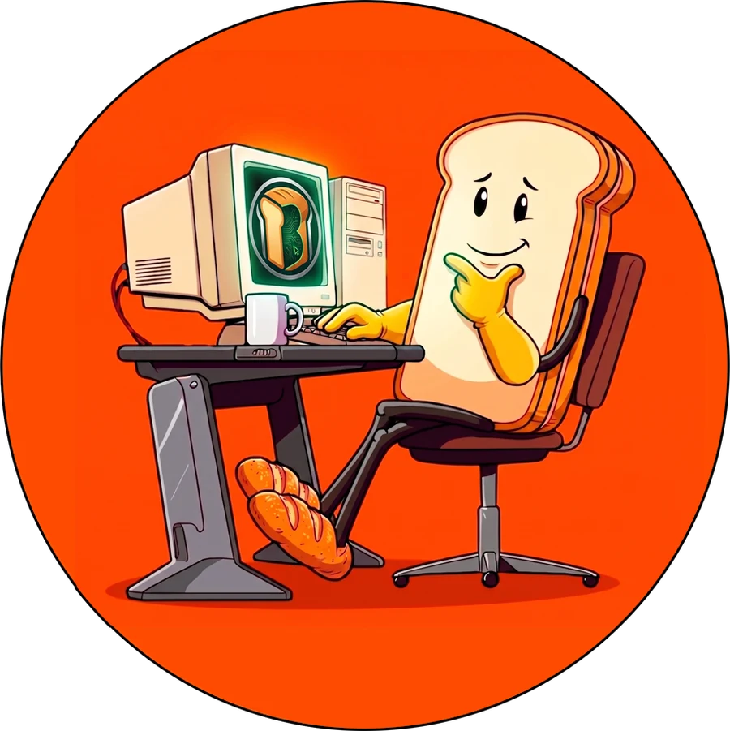

# KSBravo

Custom nextbots, NPCs and tools for Garry's Mod and s&box.

A small family studio. We model, rig, animate and compile characters for Source and s&box, and we build the tools we use to do it fast.

<a class="ks-btn" href="commissions/">Request a commission</a>
<a class="ks-btn ghost" href="work/">See our work</a>

<!-- KS-ACCESOS -->

## What we do

### Nextbots and NPCs for Garry's Mod
Your character, from a 2D image or a 3D model, turned into a working DrGBase nextbot: rig, animations, sounds, attacks, ragdoll. Delivered ready to drop into `addons`.

### Ports to s&box
The same characters running on **SBHBase**, our nextbot base for s&box: possession, factions, jumpscares, rhythm systems and more.

## Latest showcase

<iframe src="https://www.youtube-nocookie.com/embed/J8TZjflXbgc" title="3D Memes Pack 21 - Garry's Mod Ready" allowfullscreen loading="lazy"></iframe>

New packs and showcases every few weeks on [YouTube](https://www.youtube.com/@KSBravo){target=_blank}.

## How to order

<ol class="ks-steps">
<li>Send us the character through the <a href="commissions/">request form</a> or a private ticket on <a href="https://discord.gg/bMudjAq2JR" target="_blank">Discord</a>: an image, a reference video or a 3D model, and tell us what it should do (walk, run, attack, sounds).</li>
<li>We reply with a price and a delivery date for that request. Nothing starts until you agree.</li>
<li>You get a video of the character working in game before you pay.</li>
<li>You receive the addon, ready to install.</li>
</ol>

<a class="ks-btn" href="commissions/">How commissions work</a>
